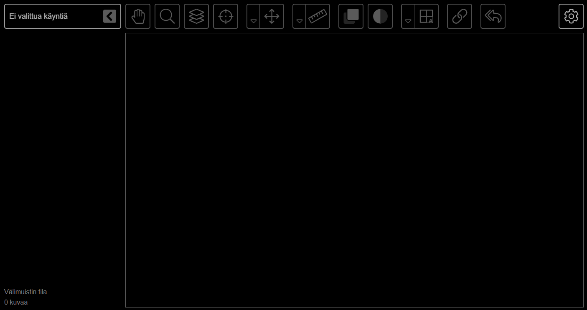

<h1>Käyttäjän opas</h1>

* TOC
{:toc}

Tämä on MEDigi-katselimen peruskäyttöopas, jossa neuvotaan sen käyttöä kuvantamistutkimusten tarkasteluun. Tällä sivulla kuvataan katselimen käytön perusteita. Moduulikohtaiset ohjeet löytyvät omilta sivuiltaan:
- [Radiologia](radiologia/)

[Julkaisijan opas](../julkaisijan-opas) ja [kehittäjän opas](/medical-imaging-viewer/en/developer-guide) löytyvät omista osioistaan.

## Katselimen avaaminen

Katselin on javascript-sovellus, jonka käyttöön tarvitaan moderni, javascriptiä tukeva web-selain. Katselin ei tue Internet Explorer -selainta. Päästäksesi käyttämään katselinta, avaa verkkoselaimellasi internetsivu, jolle se on sisällytetty. Sivu voi periaatteessa myös omalla koneellasi HTML-tiedosto, mutta joidenkin selainten tietosuojaominaisuudet rajoittavat merkittävästi paikallisiin HTML-tiedostoihin sisällytettyjen javascript-ohjelmien toiminnallisuutta.

Käyttöympäristöstä riippuen katselin aukeaa automaattisesti jonkin moduulin oletusnäkymään. Alla kuvassa näkyy radiologisten kuvien katselunäkymä:

Vasemmalla yläkulmassa näkyy pudotusvalikko, josta voi valita ladattuja kuvantamistutkimuksia. Pudotusvalikon reunassa olevasta nuolesta valikon voi pienentää katselimen sivuun, jolloin itse tutkimukselle jää enemmän tilaa.

Vasemmalla yläkulmassa näkyvästä hammasratas-napista aukeaa asetusvalikko. Asetusvalikosta on mahdollista suurentaa katselin koko ruudulle, sekä avata näkyviin yleiset sekä moduulikohtaiset asetukset. Näihin asetuksiin tehtävät muutokset tallentuvat evästeenä kyseiselle laitteelle, jos evästeet on sallittu. Evästeet ja niihin tallennetut asetukset ovat aina sivusto-, laite- ja selainkohtaisia (ts. ne toimivat vain samalla laitteella, samalla selaimella ja samalla sivustolla).

## Yleisasetukset

Kieliasetuksista voi valita käyttöliittymän kielen. Mittayksiköitä ei tällä hetkellä voi itse valita, vaan ne ovat aina metrijärjestelmän yksiköitä.

Näyttöasetuksista voit säätää käyttämäsi näytön PPI-arvoa (Pixels Per Inch). Katselin käyttää tätä arvoa tiettyjen rekisteröintien, erityisesti EKG- ja EEG-signaalien, ulottuvuuksien automaattiseen laskemiseen. Virheellisen arvon käyttäminen johtaa siis siihen, että näytöllä olevan kuvaajan fyysiset mitat eivät vastaa paperille tulostetun signaalin mittoja. Kaikki kuvaajasta lasketut arvot kuitenkin pitävät tässäkin tapauksessa paikkansa. Tyypillinen työpöytäkoneen näytön PPI-arvo on 96; mitä tarkempi näyttö, sitä suurempi arvo, yleisesti ottaen. Säädä arvoa ylös- tai alaspäin, kunnes sen alapuolella näkyvän harmaan palkin leveys on 5cm (mittanauhalla näytöltä mitattuna).

## Tiedostojen avaaminen

Sovelluksessa on mahdollista avata tiedostoja sekä kansioita raahamalla ne vasemmalla näkyvään sivupalkkiin. Moodle-lisäosassa tämä ominaisuus on kuitenkin poistettu käytöstä.

## Käyntivalikko

Ladatut tutkimukset löytyvät omien käyntiensä alta käyntivalikosta vasemmasta yläreunasta. Valikko aukeaa ja sulkeutuu klikkaamalla (tai hiiren pois viemällä). Tutkimukset on jaoteltu tutkimustyyppien mukaisesti:

Katselimen teema muuttuu tarpeen mukaan, kun valitaan uusi tutkimustyyppi.

Koko käyntivalikko ja vasen sivupalkki on mahdollista piilottaa pääosin ja tuoda takaisin näkyviin klikkaamalla otsikkorivillä olevaa nuolinäppäintä.
