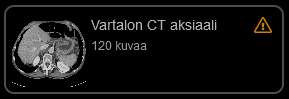

<h1>Käyttäjän opas - radiologia</h1>

* TOC
{:toc}

## 1. Yleistä

Radiologian moduulilla on mahdollista tarkastella DICOM-muotoisia radiologisia kuvantamistutkimuksia. Tällä hetkellä yksittäisten natiivikuvien ja CT-kuvapakkojen tarkastelu toimii kohtalaisen hyvin. Myös magneettikuvien ja ultraäänitallenteiden katselu on  mahdollista, mutta niistä puuttuu modaliteettikohtaisia ominaisuuksia.

## 2. Työkalurivi

Työkalurivin painikkeet eivät ole käytettävissä, ennen kuin jokin kuvantamistutkimus on avattu tarkasteltavaksi. Riippuen kontekstista, kaikkia painikkeita ei välttämättä ole käytettävissä. Työkalupainikkeet on jaettu toiminnallisesti ryhmiin, ja vain yksi työkalu per ryhmä voi olla samalla kertaa aktiivisena; työkalun aktivointi kytkee automaattisesti muut saman ryhmän työkalut pois päältä. Aktiivinen työkalu toimii aina hiiren vasenta nappia painamalla ja hiirtä liikuttamalla nappi pohjassa. Työkalurivillä on myös kolme painikeryhmää, jotka klikattaessa avaavat nkyville ryhmään kuuluvat työkalupainikkeet.

Työkalupainikkeet vasemmalta oikealle lueteltuna:
- {:height="16px" width="16px"} _Liikuttelutyökalu:_ Liikuttaa kuvaa pysty- ja vaakasuunnassa.
- {:height="16px" width="16px"} _Suurennuslasi:_ Liikuttaa kuvaa syvyyssuunnassa, ts. lähentää ja loitontaa sitä.
- {:height="16px" width="16px"} _Pakan selaus:_ Selaa kuvapakkaa, ts. näyttää järjestyksessä pakan seuraavan tai edellisen kuvan (toimii ainoastaan kuvapakoilla).
- {:height="16px" width="16px"} _Pakan kohdennus:_ Kohdentaa samasta kuvauksesta saatujen kuvapakkojen leikkeet samaan anatomiseen kohtaan (toimii ainoastaan kuvapakoilla).
- {:height="16px" width="16px"} _Kuvan suuntaus (työkaluryhmä):_
  - Kierrä vastapäivään.
  - Kierrä myötäpäivään.
  - Käännä vaakasuunnassa.
  - Käännä pystysuunnassa.
- {:height="16px" width="16px"} _Mittaustyökalut (työkaluryhmä):_
  - Välimatkan mittaus.
  - Pinta-alan mittaus (sisältää myös HU-arvon)
- {:height="16px" width="16px"} _Käänteinen ikkunointi:_ Kääntää kuvan ikkunoinnin päinvastaiseksi (ns. invertoi kuvan).
- {:height="16px" width="16px"} _Ikkunoinnin säätäminen:_ Säätää kuvan ikkunointia hiiren liikkeiden mukaisesti.
- {:height="16px" width="16px"} _Asettelutyökalut (työkaluryhmä):_
  - Automaattinen asettelu.
  - 2x2 ripustelu (manuaalinen asettelu).
- {:height="16px" width="16px"} _Kytke kaikki kuvapakat:_ Kytkee yhteen tai poistaa kytkennän kaikista auki olevista kuvapakoista.
- {:height="16px" width="16px"} _Palauta alkuperäinen näkymä:_ Palauttaa kaikkien aktiivisten kuvien kuvanäkymät alkuperäiseen tilaansa, ts. kumoaa liikuttelu-, suurennuslasi- ja ikkunointityökaluilla tehdyt muutokset.

Sekä oikeassa ylänurkassa:
- {:height="16px" width="16px"} _Asetukset:_ Koko näytön tila sekä radiologianäkymän asetukset ja yleiset asetukset.

## 3. Sivupalkki

Valitun käynnin tutkimukset aukeavat vasemmalle sivupalkkiin. Jos mahdollista, sivupalkkiin aukeaa myös esikatselukuva itse tutkimuksesta. Sivupalkin toiminta on suunniteltu vastaamaan mahdollisimman läheisesti yleistä tiedostojärjestelmän toimintaa:
- Jos yhtään tutkimusta ei vielä ole auki, tutkimuksen klikkaaminen avaa sen katselunäkymään.
- Toisen tutkimuksen klikkaaminen sulkee edellisen ja avaa klikatun tutkimuksen.
- Jos useita kuvia on näkyvissä, aktiivisen kuvan klikkaaminen piilottaa mut kuvat ja jättää klikatun kuvan näkyviin.

Jos uutta tutkimusta klikataan Control-nappi pohjassa, aukeaa klikattu tutkimus edellisen rinnalle. Jos tutkimusta klikataa Shift-nappi pohjassa, aukeavat myös kaikki aktiivisen ja klikatun tutkimuksen väliin jäävät tutkimuset.

Tutkimusten avautumisjärjestystä on mahdollista vaihtaa muuttamalla niiden järjestystä sivupalkissa (raahaamalla kuvakkeita ylös tai alas). Vaihtoehtoisesti kuvat on mahdollista sijoitella ripustelunäkymässä manuaalisesti valmiiseen ruudukkoon raahaamalla ne haluttuun ruutuun.

Ripustelutilassakin kuvia voi piilottaa ja palauttaa takaisin näkyviin aikaisempaan paikkaansa klikkaamalla sivupalkista (Control-nappi pohjassa, jos mutakin kuvia on näkyvissä.

Harvoin ripustellun kuvan lataaminen epäonnistuu, jolloin ruutuun tulee ilmoitus _"Avaaminen epäonnistui, aktivoi kuvaus sivupalkista"_.

Tällöin kyseisessä kuvassa näkyy sivupalkissa häiriökuvake. Kuvauksen saa näkyviin klikkaamalla kuvausta sivupalkissa (muista painaa Control-nappi pohjaan, jos olet jo avannut muita kuvia!).

