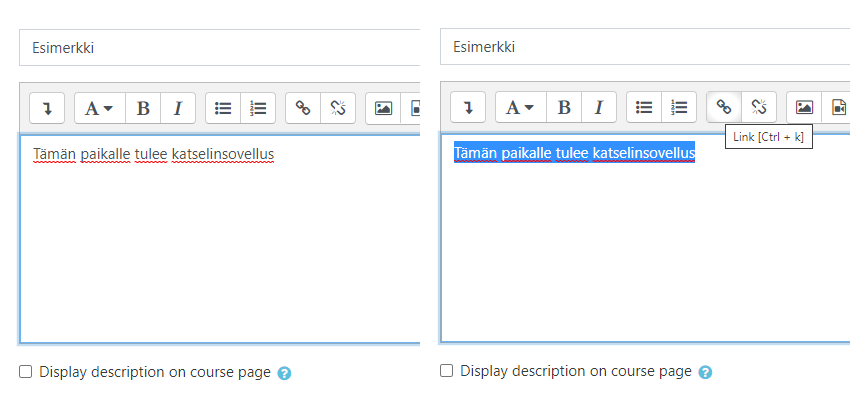
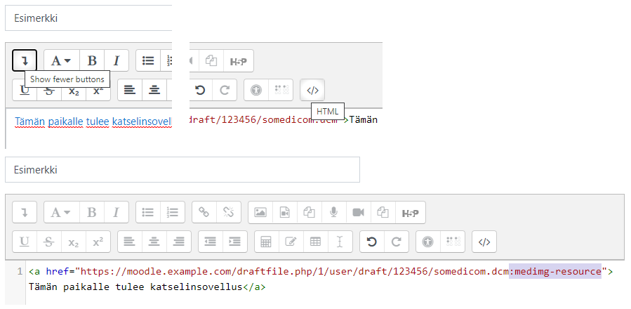
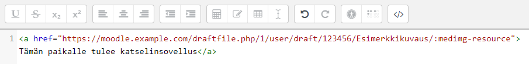

<h1>Katselimen Moodle-lisäosa</h1>

* TOC
{:toc}

## Yleistä

Katselimen käyttöön Moodlessa tarvitaan erillinen lisäosa, ns. filtteri. Lisäosa poimii tekstistä tunnisteen, jonka perusteella se käynnistää katselinsovelluksen ja lataa siihen halutut tutkimukset. Tunniste on mahdollista kirjoittaa myös käsin, mutta sen syöttäminen on helpompaa toisen, valinnaisen lisäosan avulla, joka laajentaa Moodlen Atto-tekstinkäsittelijän ominaisuuksia.

## Moodle filter

Filtteri tunnistaa tekstin joukosta sellaiset hyperlinkit, joissa on tietty tunniste perässä. Tämän jälkeen filtteri korvaa kyseisen linkin katselinsovelluksella, johon se avaa linkin kohteen.

### Linkin lisääminen manuaalisesti

Mikä tahansa linkki on mahdollista merkata sovullekselle `:medimg-resource`-tunnisteella linkin href-kentässä.

Esimerkki: Kirjoita mikä tahansa kuvaava teksti (tämä näkyy vain sisällön muokkaajille) ja linkkaa siihen haluamasi kuvantamistiedosto.

Avaa lisätyökalut vasemmassa ylänurkassa olevasta nuolesta ja aktivoi HTML-muokkaustila. Tämän jälkeen lisää tekemäsi linkin href-kentän loppuun `:medimg-resource`.

Muokkaajalle linkki näkyy edelleen linkkinä, mutta Moodlen käyttäjälle latautuu katselinsovellus linkin tilalle. Linkattu tiedosto avautuu katselimeen automaattisesti.

Moodlen linkkausominaisuus ei ikävä kyllä tue kansioiden linkkaamista, mikä tekee niiden manuaalisesta lisäämisestä aavistuksen haastavampaa. Jos edellisen esimerkin tiesoto olisi ollut kansiossa `/Esimerkkikuvaus/somedicom.dcm` ja tarkoituksena olisi linkata koko kansio, olisi linkki pitänyt tehdä ensin itse tiedostoon ja tunnistetta lisättäessä poistaa tiedoston nimi, jolloin lopullinen href-kenttä olisi ollut `https://.../Esimerkkikuvaus/:medimg-resource`.

### Linkin lisääminen Atto-pluginia käyttäen

Moodlen Atto-tekstinkäsittelijään on saatavilla lisäosa, joka helpottaa paitsi tiedostojen, erityisesti kansioiden linkkaamista.
